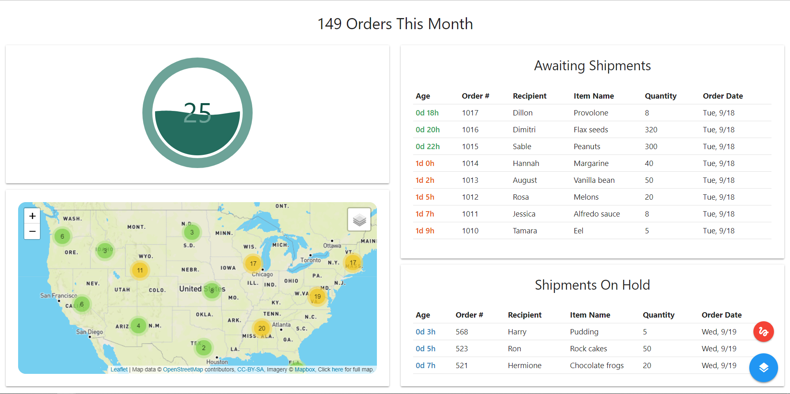
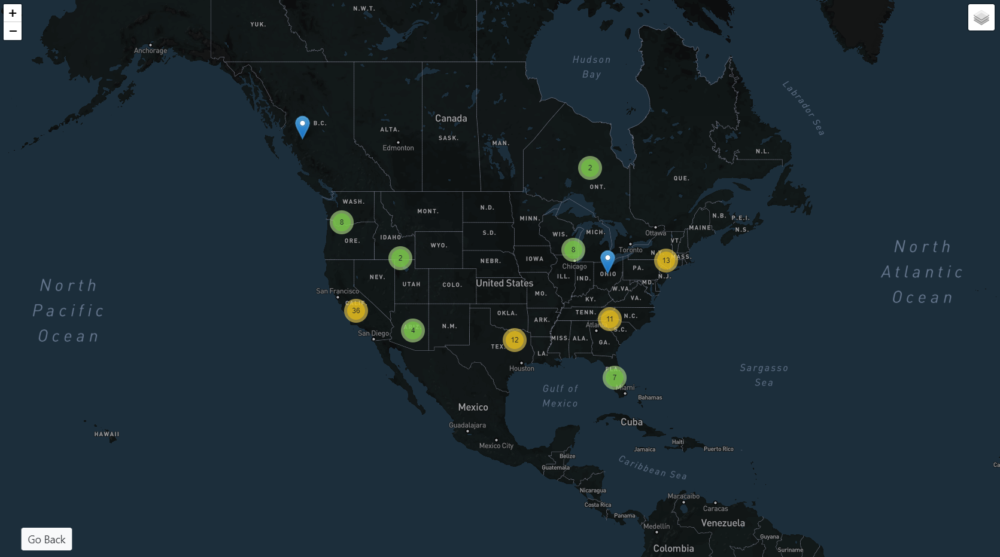

# ship-live
Shipstation dashboard revealing important indicators such as awaiting and on-hold shipments, total number of orders this month, and an interactive map of order locations.

## Technology Stack
Python 3.6 
Flask 
Sqlite 
Javascript 
HTML/CSS/Materialize 

## License
[MIT](LICENSE) © Justin Le